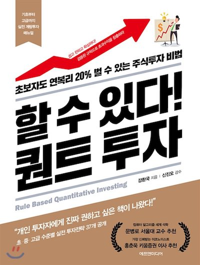

# Qu-ant
Quantative Ant.

Have fun with [Backtrader](). :)

## Pre-requisites
- Python3 (3.7+, recommend [anaconda](https://docs.anaconda.com/anaconda/install/mac-os/)) 
- Enough time.

## Install packages
   
    pip install -r requirements.txt
    # (or pip3, based on your env)
    
## Run notebook

    # Set PWD as PYTHONPATH
    PYTHONPATH=$(PWD):$PYTHONPATH
    
    # or simply,
    ./run_notebook.sh
    
    # if you use IntelliJ, you can open project and run your notebook in the IDE.
    
## Project structure
    
    - data
       |- daily                 daily price data will be stored here.
    - lib
       |- indicators            custom indicators(https://www.backtrader.com/docu/indautoref/) 
       |- strategies            custom strategies(https://www.backtrader.com/docu/strategy/)
       |- utils                 custom helper modules
    - notebooks
       |- boiler_plate.ipynb    short introduction. you can start your notebook by ctrl+c, v this.
       |- examples              back-test & benchmark test examples

## Examples and boiler plate.

Backtrader is the one of the best back-testing frameworks.
But, in my opinion, there's pretty much learning curve expected espeically for who has never used any other similar back-testing framework before. I really recommend you to read the [docs](https://www.backtrader.com/docu/) casefully before you jump into developing your own strategy.

There is a great [quick start tutorial](https://www.backtrader.com/docu/quickstart/quickstart/) on their website. But you will notice that you can't really "quick start" as soon as you click the link and start scrolling down the page. 

I wrote a [humble notebook page](notebooks/boiler_plate.ipynb) that you can "quickly" run and see what's going on. Hope it helps you get to know how and what to use to implement and test your strategy.

Also, in the examples dir, I will implement my own back-test and benchmark report as exercise. I'm going to implement some strategies introduced in this book and run back-tests to verify them.

# Cheers!
